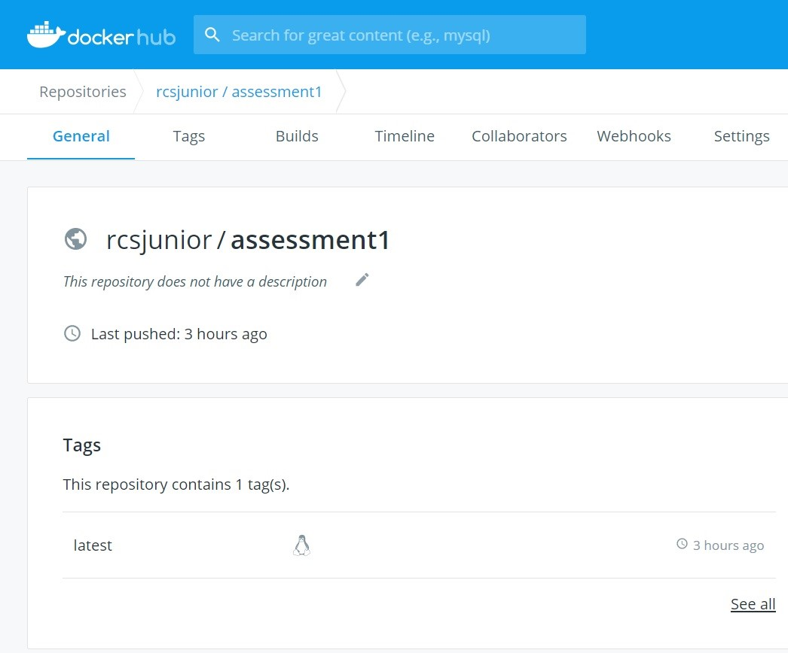
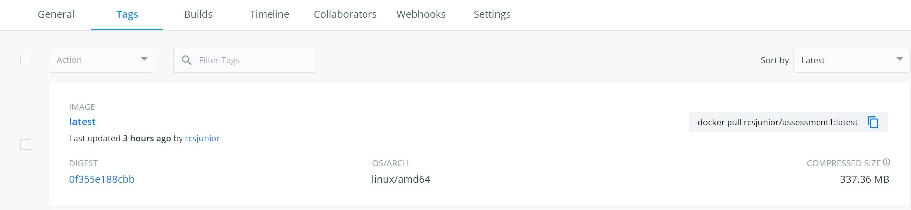

#### 1.	INTRODUCTION

Throughout this software, a user clicks in the picture of a club from the Spanish soccer league to view who the team's current players are. Furthermore, the user may click in a link to view how the last season table looked after the matches played, possible by API's manipulation from the server-side and bootstrap, Html and CSS from the client-side. 

#### Sports DB API

#### Home URL: thesportsdb.com/
Sports DB API is an open crowd-sourced database of sports artwork and metadata with free APIs generates by user contribution, which allows users to query teams, players in teams, player details, player contract details, and just about any player or team data from a broad range of sports such as soccer/football and handball.

#### 2.	USER CASE

As a user, I want to see a list of the clubs that made part of the season 2019-2020 from the Spanish soccer (called La Liga) to select the club I would like to have more information.

###### Figure 1 - HomePage.

###### Figure 2 - Clubs from La liga, season 2019-2020.

#### 3.	TECHNICAL DESCRIPTION OF THE APPLICATION
The overall implementation of this service is built by JavaScript and CSS3 stylesheets in the Client-side and Node.js server to build the services in Docker containers. The client-side, which is responsible for sending requests to the server, getting the responses, and handles the pages and API's using HTML5, CSS3, and JavaScript.

#### 4	PROJECT STRUCTURE
The project structure is a general Express Node.js web application that separates the different parts of the app and makes the code easier to maintain. A brief explanation of this structure is shown below.
APPFILES/
	/public - Contain the CSS File.
	      /Styles.css
	/routes – Contain the app routes.
	     /players.js
	     /table.js
	     /teams.js
	App.js - Initialize the app and glue everything together.
	Package.json – Description of all packages that the app depends and their versions.
	
#### 5	PROJECT DATA FLOW

A basic overall representation of the data flow is shows by the image bellow.

###### Figure 3 - La Liga data flow.

#### 6.	CLIENT

The client-side is responsible for sending requests to the server, getting the responses, and handles the pages and API's using HTML5, CSS3, and JavaScript.

Initially, the La Liga id is passed as a parameter to League Details by Id API endpoint, which returns a JSON object with the league information to be used from the Client to build the index page, displaying the La Liga's logo in the Home screen.

Clicking in the league's logo sends a request to "/search" (server-side) with the league id and season as parameters that handle that request, giving the Client a list of La Liga clubs' logo and names that are displayed in the screen. From that on, clicking in a club's logo sends a request to the server-side with the club id, returning the Client a list of the players from the chosen club that are processed and displayed by the Client. Whereas, clicking in the link Go to season table displays how the league's table looked after all the matches played.

#### 7.	SERVER

Given a client's request, the server-side deals with the extended requests to external APIs and respond to the client with the relevant information. This server-side runs on Express JS web framework sited on two layers that are Node JS and Docker Container. This service uses several node packages such as express (Web framework which the service is built), Morgan (HTTP request logger middleware), and Axios (Promise based HTTP client for the browser and node.js).

#### 8.	DOCKER

The Docker configuration for this application is relatively straightforward. Firstly, Docker is used to binding the whole application into a container under an image, including the server, Node Modules, package.json files, and a folder containing CSS styles. Second, YARN is used as it automatically fixes the packages if any issues arise. Third, the port in which the node server runs are exposed (3000), and finally the CMD app.js is used to start the application.

###### Figure 4 - Docker hub page.

###### Figure 5 - Docker hub page.

